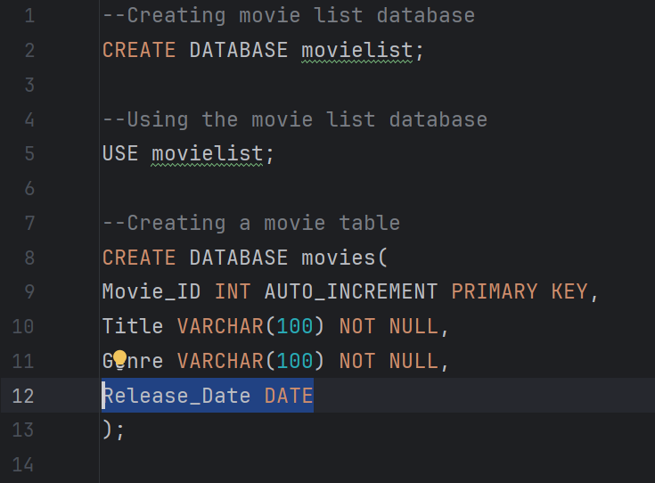

# KNOWN Limitations & Debugging Analysis

## Movies Project 2 - CREATE Module

- This document outlines identified runtime issues within the Movies Database System, including root cause analysis and planned architectural improvements
- The purpose of this document is to document debugging practices, system-level analysis, and forward-thinking version planning.

---

## 1. Compile-Time Status

- No Java compile-time (syntax) errors were detected in the Movie Project 2 (CREATE Module).
- The application compiles and executes successfully.

---

## 2. Runtime Logical Issue(s) Identified

### Issue Description:

- A 'NULL' value appears in the **Release Date** data column after a user's data submission, despite providing correct **Date** values.

- The UI is none descriptive and poor ; user is not alerted on acceptable date format. Errors may occur if user provides incorrect input format.

- Syntax has no data validation, resulting in incorrect data collection

### Observed Description

- The application successfully connects to the database.
- Movie data provided from the user is accepted from the UI, but no data validation is made in the background.
- Poor user experience **(no acceptable date format communicated to the user)**
- Potential future errors if date operations are performed.

### Impact

- Data inconsistency in the Movies Database System
- Reduced data integrity in the database
- poor user experience

---

## 3. Root Cause Analysis

The issue originates from 2 parts of the Movies Database System; namely the database structure and Java syntax located in the DataAdmin class.

### Identified Causes:

- **Database Structure**

Inadequate constraints in the database, specifically the release date column, resulting in 'null' values.

 

  

**Screenshot of SQL script; inadequate constraints in release date column**

  

- ## **Data-related syntax**

Syntax which handles data inputs doesn't passall data from the user's inputs, but passes a 'null' value from a local variable.

**Screenshot of Java syntax which handles data inputs**

**User-Interface experience**

-

---

---

## 4. Architectural Insight

---

## 5. Planned Improvements (VERSION 2 Roadmap)

---
