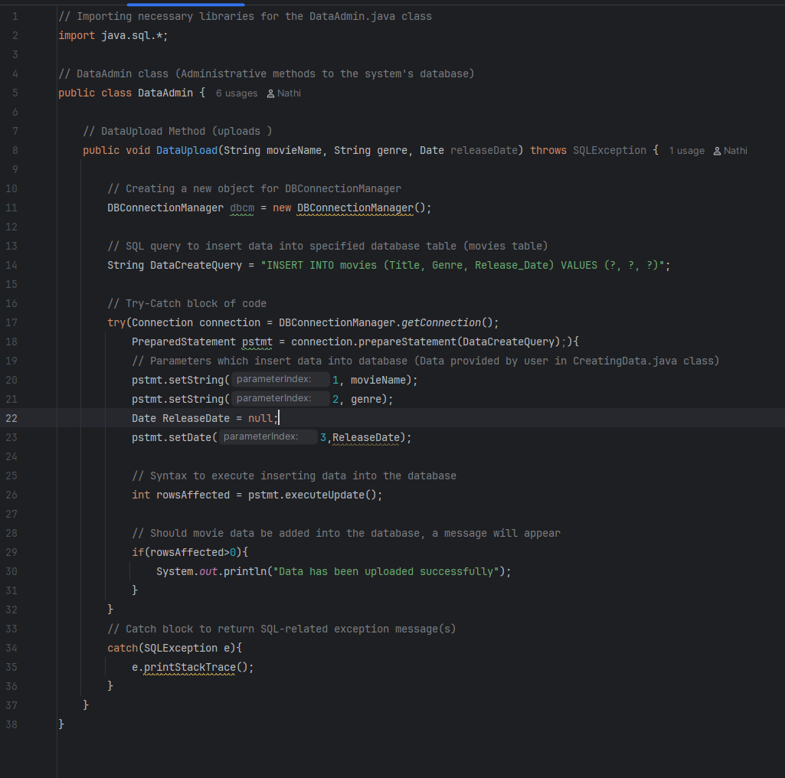
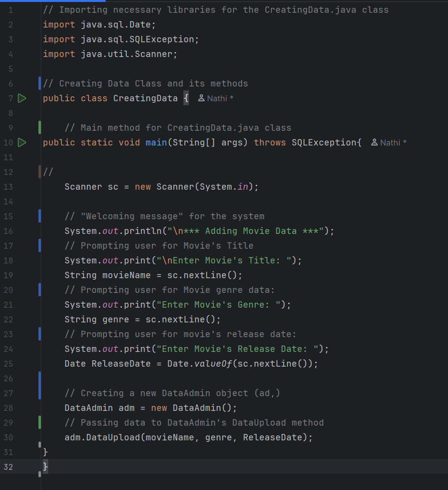
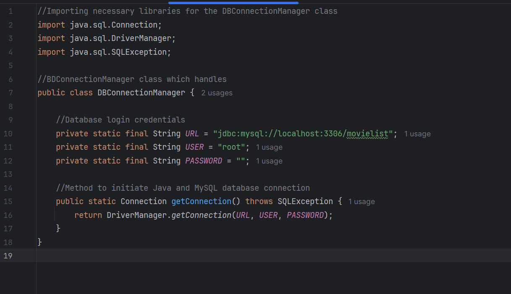
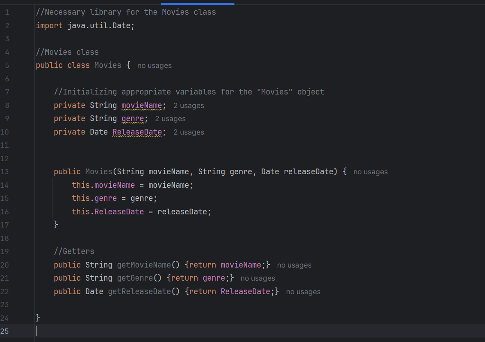

# MOVIES DATABASE CREATING DATA PROJECT

## Application Overview

- A simple **Java terminal-based application** that connects to a **MySQL database using JDBC** and allows a user to add movie related data.
- The system demonstrates basic database integration and CRUD (CREATE) functionality.

---

## **System's functions**


**Features**
- Terminal-based interface
- MySQL database integration via JDBC
- Allows user to add data into database
- Lightweight and beginner friendly
- Clean project structure


---

## Technologies Used

Technology    | Purpose
--------------|--------------
Java (JDK 8+) | Application logic
MySQL         | Database
JDBC          | Database Connectivity
IntelliJ IDEA | Development Environment
SQL           | Data management


---

## Project Structure

````
Movies Project 2
||
|| ===> Screenshots
||
|| ===> src
||     || ===> CreatingData.java
||     || ===> DataAdmin.java
||     || ===> DBConnectionManager.java
||     || ===> Movies.java  
||
||
|| ===> ReadME.md
|| ===> KNOWN_LIMITAITIONS.md 
````

---

## Setup Instructions

## Class Overview

**DataAdmin.java**

- This java class handles the method required to add movie data into the movies database.

<div align="center">


**Screenshot of the DataUpload method within the DataAdmin java class**
</div>

---
**CreatingData.java**

- This is the main class which renders the application for the user to provide data of a movie.

<div align="center">


**Screenshot of the main method within the CreatingData java class**
</div>

---

**DBConnectionManager.java**

- The purpose of this java class is to initialize and manage the connection between the Java logic and MySQL database, through a JDBC (Java Database Connection) driver.

<div align="center">


**Screenshot of the DBConnectionManager class' syntax**
</div>

---
**Movies.java**

- The initial purpose of this class is to explore the use of the Object-Orientated Programming (OOP) concept in this application.
- In this version of the application, the Movies.java class is unnecessary and makes no contribution  to the project.

<div align="center">


**Screenshot of the Movies.java class**
</div>


---

## Contributions

- **Project Author: Nathi Mailula**
- **Developed: February 2026**

---